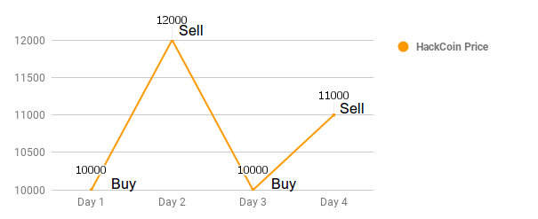
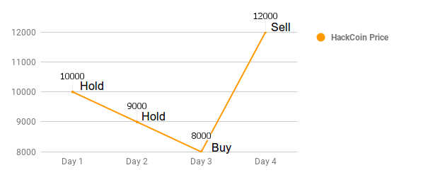
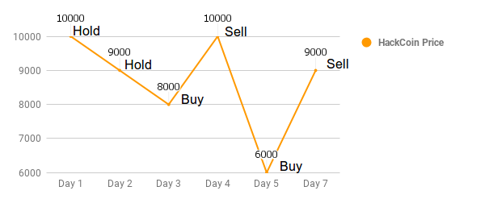

# HackCoin Trader

In a galaxy far far away, there is a cryptocurrency called HackCoin. Chewbacca has a superpower to predict the HackCoin price for the **next couple of days**.

In order to help Chewbacca you have to create a program that takes his prediction and returns `buy`, `sell` or `hold` actions for every day. The goal is to maximize the profit.

## On language of your choice write a program that:

### Takes two arguments from the standard input.

 - Amount of money that you start with.
 - An array of HackCoin price for the next couple of days.

### Prints on the standart output.

 - The total amount of money that you end up with.
 - An array of `buy`, `sell`, or `hold` position for every day

## You have to keep the basic stock exchange principles.

 - Buy if the price is going to go up.
 - Sell if the price is going to go down.
 - Hold if the price is going to go down and you have already sold.
 - Hold if the price is going to go up and you have already bought.

**Note**: You always start with fiat money not HackCoins. So your first action may be `buy` or `hold`.

**Note**: You always buy or sell the entire amount you currently have.

**Note**: You always have to end up with fiat money. So your last action must be `sell` or `hold` if you have already sold.

**Note**: You always have to format the final amount like so:
 - Always display two decimal digits.
 - Remove the rest of the digits after the second decimal digit. 
    - 100 -> 100.00
    - 99.123434... -> 99.12
    - 199.999999 -> 199.99

**Note**: The start amout is allways going to be an integer. 

**Note**: The array of the HackCoin prices is always going to contain more than one element.

## How to calculate the profit?

If at a certain time the price for one HackCoin is 100$, and you spend 25$ on a HackCoin - that means that you receive 0.25 HackCoins.
**Note** that it is not necessary for you to buy an entire coin at once, you can buy a fraction of one coin with the money you possess.

If the price on the next day is 200$, that means that 0.25 HackCoins now cost 50$.

## Example 1:

Input:
```
100
10000, 12000, 10000, 11000
```


Output:
```
132.00
buy, sell, buy, sell
```

## Example 2:

Input:
```
100
10000, 9000, 8000, 12000
```


Output:
```
150.00
hold, hold, buy, sell
```

## Example 3:

Input:
```
100
10000, 9000, 8000, 10000, 6000, 9000
```


Output:
```
187.50
hold, hold, buy, sell, buy, sell
```

## Example 4:

Input:
```
100
10000, 9000, 8000, 7000, 6500, 6000
```

Output:
```
100.00
hold, hold, hold, hold, hold, hold
```
