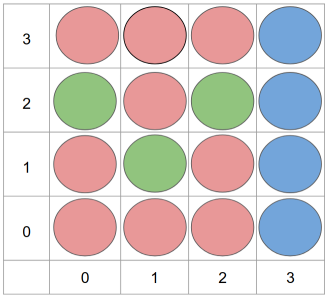
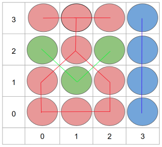
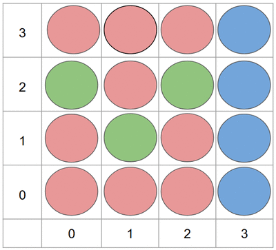
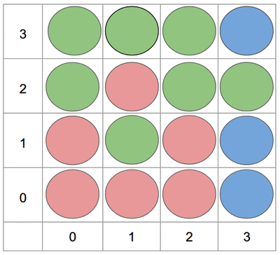

# Color bombs

## Bomb field

Bomb field is a matrix with bombs. Each bomb can be `red`, `green` or `blue`.



When you click on a bomb all the `connected` bombs explode. 

## Connected bombs

Connected bombs are every bombs with the **same color** that are connected in one of the **8 directions**. (up, down, left, right, and the diagonals)

On this example bomb field we have 3 groups of connected bombs. So we are going to need 3 clicks to explode all the bombs.



---

## On language of your choice write a program that:

Takes a bomb field from the standard input and prints the amount of clicks that you need to do in order to explode all the bombs.

**NOTE:** The bomb field can be any rectangle with dimensions from 4 to 20! The end of the input is going to be marked with a blank line.

**NOTE:** The bombs don`t fall down if there is nothing below them. Look at the example animations for more context!

## Example 1

Input:
```
RRRB
GRGB
RGRB
RRRB

```

Output:
```
3
```





## Example 2

Input:
```
GGGB
GRGG
RGRB
RRRB

```

Output:
```
4
```


